`OBSIDIAN · PROJECT MANAGER COMPANION`

# 🫧 Project Manager Insights ✨

**Turn individual execution into traceable team-delivery insight with Project Manager data.**

A read-only insight layer for Project Manager that extends its projects, tasks, hierarchy, tags, and statuses into cross-project workload, delivery progress, and schedule-risk views—without changing task notes.

[](https://community.obsidian.md/plugins/project-manager-insights)
[](https://github.com/CoffeeCheese/obsidian-pm-insights/releases)
[](https://github.com/CoffeeCheese/obsidian-pm-insights/releases)


[**Install from Obsidian**](https://community.obsidian.md/plugins/project-manager-insights) · [Releases](https://github.com/CoffeeCheese/obsidian-pm-insights/releases) · [Report an issue](https://github.com/CoffeeCheese/obsidian-pm-insights/issues)

**English** · [简体中文](README.zh-CN.md)

<p align="center">
  <strong>One project data source, two connected workspaces</strong><br>
  <sub>Project Manager maintains tasks and schedules&nbsp;&nbsp;→&nbsp;&nbsp;PM Insights surfaces team delivery and risk</sub>
</p>

<table>
  <tr>
    <td width="53%" align="center" valign="top">
      <strong>Project Manager · Data &amp; execution</strong><br>
      <sub>Create tasks · Schedule dependencies · Move work</sub>
    </td>
    <td width="47%" align="center" valign="top">
      <strong>PM Insights · Read-only insight</strong><br>
      <sub>Cross-project progress · Delivery risk · Data quality</sub>
    </td>
  </tr>
  <tr>
    <td valign="top">
      <a href="docs/assets/obsidian-pm-work-surfaces.png">
        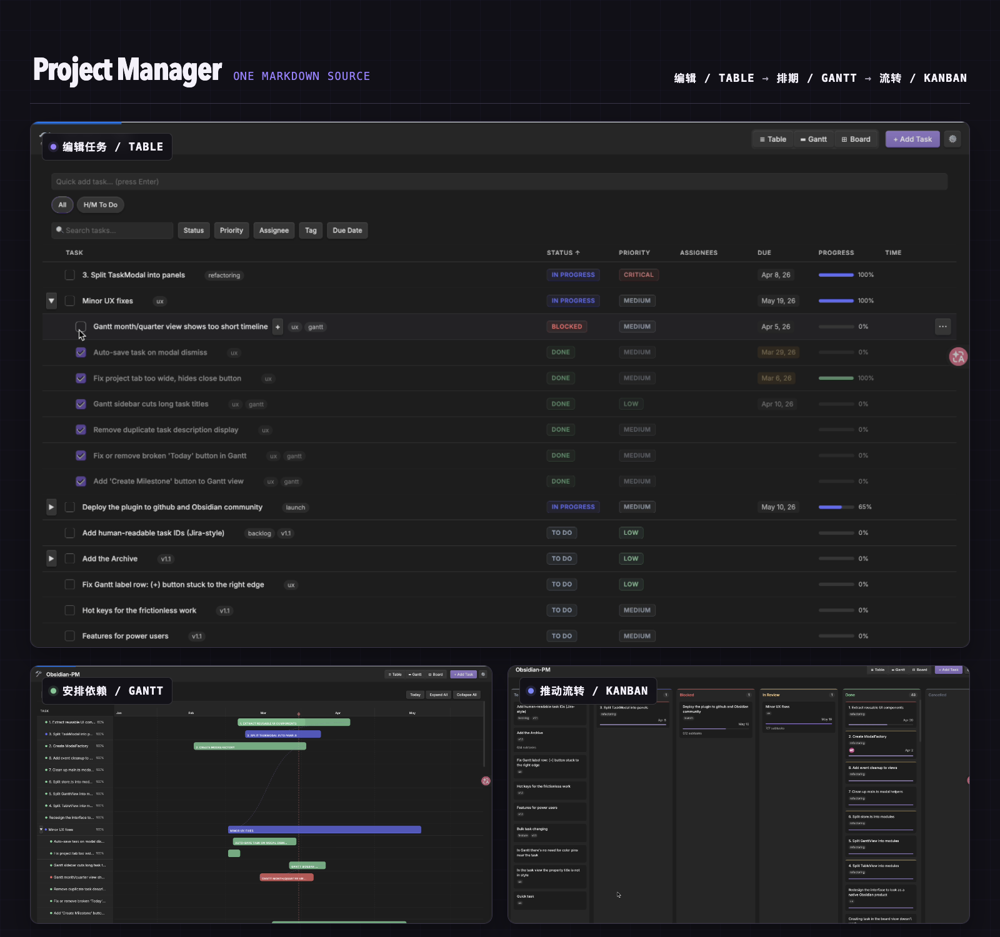
      </a>
    </td>
    <td valign="top">
      <a href="docs/assets/pm-insights-overview-0.3.1.png">
        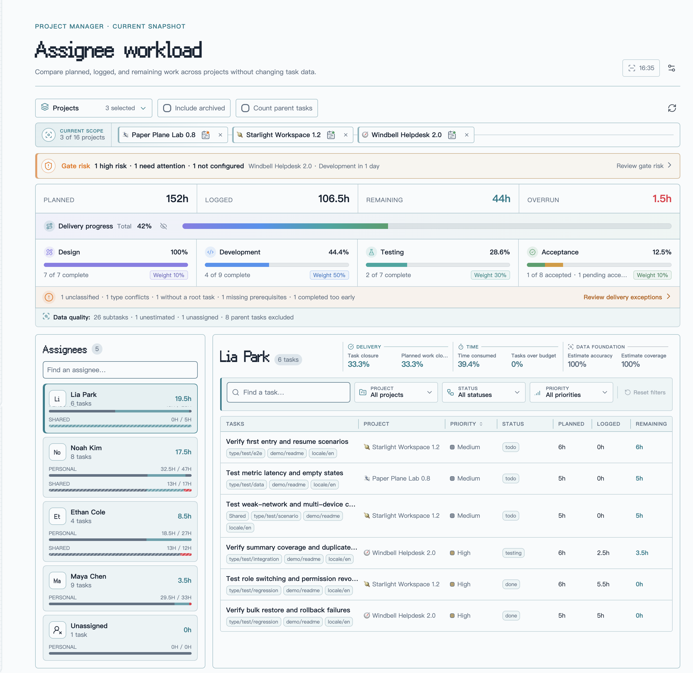
      </a>
    </td>
  </tr>
</table>

<p align="center"><sub>The left side creates and maintains execution data; the right side reads it to explain and trace team delivery. Click either image to view it at full size.</sub></p>

## I. Plugin overview: from individual execution to team delivery

[Project Manager](https://github.com/stepankropachev/obsidian-pm) is the data foundation and task-operation layer for this plugin. It stores projects and tasks as Markdown files and YAML metadata in your Vault, and provides tables, Gantt charts, boards, task hierarchy, dependencies, schedules, assignees, and time tracking.

Project Manager Insights is a **read-only insight layer** built on top of that data. It does not replace Project Manager or create a second project database. Instead, it continues from Project Manager's existing metadata and task relationships, expanding execution data that is normally viewed one project or one task at a time into additional project-management perspectives.

### 1. How the two plugins divide responsibility

| Layer | Primary responsibility |
| --- | --- |
| **Project Manager: data and execution** | Create and maintain projects, root tasks, and subtasks, including type, hierarchy, status, priority, dates, progress, estimates, logged time, assignees, tags, and custom fields. |
| **Project Manager Insights: insight enhancement** | Aggregate the same data without writing to it, adding cross-project, member, delivery, acceptance, data-quality, and schedule-risk views without disrupting the existing workflow. |

### 2. How the two workspaces connect

The same Markdown project data flows through both workspaces: teams create tasks, schedule dependencies, and move work through statuses in Project Manager; PM Insights then aggregates those execution records without writing to them and brings cross-project progress, delivery risk, and data quality into one workspace.

> **The handoff:** Project Manager produces trustworthy execution data. PM Insights turns it into traceable team-delivery signals without taking ownership of the source tasks.

### 3. How metadata becomes additional perspectives

```text
Project Manager data source
Project files · task files · YAML metadata
Type · hierarchy · status · dates · hours · assignees · tags
                    │
                    ▼ read-only parsing and relationships
        Project Manager Insights
                    │
                    ├── one project → a cross-project scope
                    ├── individual tasks → team workload
                    ├── task statuses → stage delivery and acceptance
                    ├── schedule dates → delivery-gate risk
                    └── insight results → the source task in Project Manager
```

### 4. The perspectives added by PM Insights

After you select one or more Project Manager projects, PM Insights adds:

- **Project scope:** know exactly which projects every module is currently analyzing.
- **Team and individual:** move from cross-project workload into member tasks, shared work, project-level workload, and delivery-capacity checkpoints.
- **Delivery and acceptance:** derive stage completion and requirement acceptance from hierarchy, stage tags, and task statuses.
- **Data quality:** find missing estimates, assignees, classifications, conflicting stage tags, and missing prerequisites.
- **Schedule and risk:** compare actual stage progress, expected progress, task due dates, project gate dates, and owner capacity.
- **Source traceability:** return from a metric, exception, or risk task directly to its Project Manager project or task editor.

All of these views share the same local Project Manager data. Every number and warning can be traced to the project and task that produced it, while the analysis itself leaves the source untouched.

> [!NOTE]
> Install Project Manager and create your projects and tasks there first. Project Manager Insights adds observation and interpretation; it does not modify project notes, task notes, or Project Manager's data model.

This README moves from overview to detail:

```text
Plugin position
   ↓
Feature map
   ↓
Task-tree design logic
   ↓
Core capabilities
   ↓
Statistical boundaries and getting started
```

## II. Feature map: the questions you can answer at a glance

| Insight | Question answered |
| --- | --- |
| **Project scope** | Which projects are included in the current dashboard? |
| **Team workload** | How much was planned, logged, remains, and has run over? |
| **Member insight** | What does each person own, which delivery windows are approaching, and can the current project workload fit into the capacity available before each delivery date? |
| **Delivery progress** | Which stage has the work reached, and how far is it from acceptance? |
| **Delivery exceptions** | Which tasks are not classified correctly or are blocking acceptance? |
| **Gate risk** | Are actual progress and owner capacity keeping pace with stage gates and the final launch plan? |
| **Data quality** | Which execution tasks are still missing estimates, assignees, or due dates? |
| **Task traceability** | Which source task produced a metric or warning? |

This section shows what PM Insights can answer. The next section explains how those answers are derived from Project Manager data.

## III. Design logic: deriving project insight from tasks

PM Insights does not place every task into a single flat count. It first reconstructs the Project Manager task tree, then calculates root tasks and subtasks separately according to hierarchy, tags, and statuses:

```text
Project Manager project
        │
        ▼
  Read the complete task tree
        │
        ├── Root tasks (requirement dimension)
        │      ├── decide whether a requirement is complete
        │      ├── check whether required stages are ready
        │      ├── derive acceptance progress and blockers
        │      └── find missing prerequisites or early completion
        │
        └── Subtasks (execution dimension)
               ├── map work to delivery stages by tag
               ├── calculate stage completion from status
               ├── aggregate assignees, estimates, and logged time
               └── check scheduling, gates, owner capacity, and data quality
```

Four kinds of information play distinct roles:

| Data source | Role in the insight model |
| --- | --- |
| **Root task** | Represents a requirement or delivery target, used for acceptance progress, prerequisite completeness, and requirement closure. |
| **Subtask** | Represents execution work, used for stage progress, member workload, hours, scheduling, and risk. |
| **Task tags** | Map subtasks to delivery stages. A missing or conflicting mapping becomes a delivery exception. |
| **Task status** | Determines whether work is complete, cancelled, or archived, and whether it contributes to progress, remaining hours, and risk. |

Each project therefore has two complementary paths: **subtasks show how the team is executing, while root tasks show whether requirements have actually reached acceptance and delivery standards.** A root task represents a requirement and does not need to duplicate the hours carried by its subtasks; subtasks represent the concrete effort and stage movement, preventing parent and child work from being counted twice.

The interface supports English and Simplified Chinese and follows the active Obsidian theme. On narrow screens, the task-title column remains visible while the other fields can scroll horizontally.

## IV. Core capabilities: from scope confirmation to source-task traceability

The capabilities below share one analysis chain: define the project scope, move from team workload into individual execution, use the task tree to inspect delivery progress, exceptions, and gate risk, then return to the source task in Project Manager to act on the result.

### 1. Project scope management: know what you are analyzing

#### Select and adjust projects

Combine any Project Manager projects in the Vault. The current selection remains visible at the top of the dashboard, so the boundary is never lost while reading cross-project data.

- Search for and select multiple projects at once.
- Remove a project directly from its scope chip.
- Open PM Insights from a Project Manager project page and focus that project automatically.

#### Keep one shared analytical boundary

Team workload, member insight, delivery progress, delivery exceptions, and gate risk always use the same project scope. Adding or removing a project updates every view together, preventing different modules from silently analyzing different data sets.

### 2. Team workload: move from total effort to individual execution

#### Read the team snapshot

The team snapshot combines the selected projects into four practical workload metrics:

| Metric | Calculation |
| --- | --- |
| **Planned** | Sum of estimates for all included tasks. |
| **Logged** | Sum of time-log entries for included tasks. |
| **Remaining** | `max(planned - logged, 0)` for open, estimated, non-archived tasks. |
| **Overrun** | `max(logged - planned, 0)` for estimated tasks. |

#### Separate personal and shared work

Choose a member from the team overview to inspect personal and shared tasks separately. A shared task appears for every related member but contributes only once to the team total. Unassigned and unestimated work remains visible rather than disappearing because its data is incomplete.

#### Open a focused personal dashboard

After selecting a member, use the gauge button beside their name to open a centered **Personal delivery brief**. The modal concentrates on one decision: can this person's current project workload fit into the working capacity available before each project delivery date?

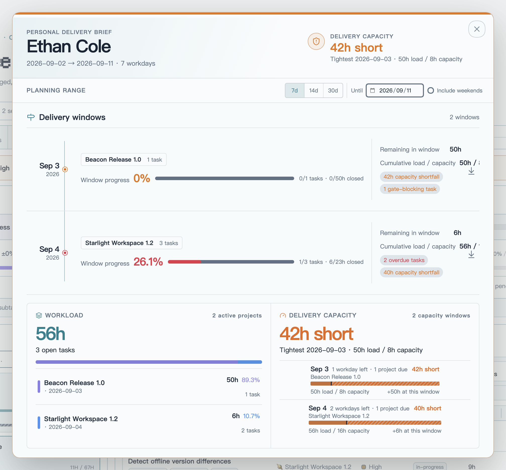

*The screenshot uses fictional README demo projects and members only. On each capacity rail, the marker shows the available-capacity limit and the striped segment shows work that no longer fits before that delivery date.*

| View | What it explains |
| --- | --- |
| **Delivery windows** | Shows the stage-derived delivery dates inside the selected planning range. Projects and stages sharing a date are grouped into one window with task progress, closed and remaining hours, cumulative load versus capacity, and concrete risk signals. |
| **Project workload** | Summarizes all valid unfinished work assigned to the member across the current project scope, independent of the 7-, 14-, or 30-day range. Each project shows remaining hours, personal share, task count, delivery stage, and derived delivery date. |
| **Delivery capacity** | Orders projects by their derived delivery dates, then compares cumulative remaining workload with cumulative available hours at every checkpoint. Earlier commitments consume capacity before later ones, making buffer, tight windows, shortfalls, and overdue delivery dates immediately visible. |

Select a delivery window, project workload row, capacity checkpoint, or planning-confidence note to close the modal and filter the related source tasks. The planning range starts today and controls only which delivery windows appear in the timeline: choose 7, 14, or 30 schedule days, or set a custom end date. Project workload and delivery-capacity checkpoints continue to cover all current work in the selected project scope. **Include weekends** changes schedule-day counting and capacity calculations, but never which tasks belong to the workload; the hours per workday and calendar day come from **Settings → PM Insights → Gate risk rules**.

Each member's work is grouped by project and assigned the gate date of its farthest mapped delivery stage. Parent work inherits the stages covered by its executable descendants, and cross-stage work uses the latest stage in the configured delivery order. Task due dates remain schedule-risk signals but do not position project delivery commitments, and the project launch date is never used as a fallback. Shared-task estimates, logged hours, and remaining hours are divided evenly among resolved assignees. Missing estimates and unresolved stages stay visible as planning blind spots, reducing confidence without inventing dates or hours.

#### Normalize member names

Member aliases can combine different assignee spellings into one reporting name—for example, “Alex,” “A. Chen,” and “Chen” can all roll up to “Alex Chen.” Source task content is not changed.

### 3. Delivery progress: see stage movement and acceptance outcomes

Delivery progress is not a single completion percentage across every task. It starts from the complete task trees in the selected projects, uses subtasks to observe each business stage, uses root tasks to decide whether a requirement is ready for acceptance, and finally combines the configured stage weights into total delivery progress.

Each stage card also compares actual progress with the progress expected from its configured project gates. A marker pins the expected position directly to the progress rail, while the card reports the exact lead or lag in percentage points. Across projects, expected stage progress is weighted by the number of relevant tasks, and acceptance is weighted by root-task count; if any relevant project is missing gate dates, PM Insights asks for complete scheduling instead of showing a partial, misleading variance.

This view answers four questions:

- How far have design, development, testing, or other custom stages progressed?
- Have requirements with completed prerequisites actually entered or passed acceptance?
- Which tasks were excluded from stage statistics because of hierarchy or tag problems?
- How should delivery be interpreted when several projects are analyzed together?

Delivery stages are not a hard-coded template. PM Insights provides one global stage model that can follow a software, content, operations, or other delivery process. You define the order, classification rules, acceptance prerequisites, and final weights. The model applies to all projects, while each project keeps its own task data and gate schedule.

#### Key-node map

```text
Configure the team's delivery model
        │
        ├── Stage order ────── define workflow sequence
        ├── Tag mapping ────── map each leaf subtask to one stage
        ├── Prerequisites ──── define when a root is ready for acceptance
        ├── Empty-stage rule ─ choose between 0% and skipped
        └── Stage weights ──── total must equal 100%
        │
        ▼
Analyze complete task trees in the selected projects
        │
        ├── Subtask status ─── calculate business-stage completion
        ├── Root status ────── separate not ready, pending, and accepted
        └── Hierarchy/tags ─── produce traceable delivery exceptions
        │
        ▼
Delivery view in the dashboard
        │
        ├── Stages: completed count · percentage · weight
        ├── Acceptance: accepted · pending · not ready
        └── Total: weighted across the currently effective stages
```

#### Settings: turn team rules into a stage model

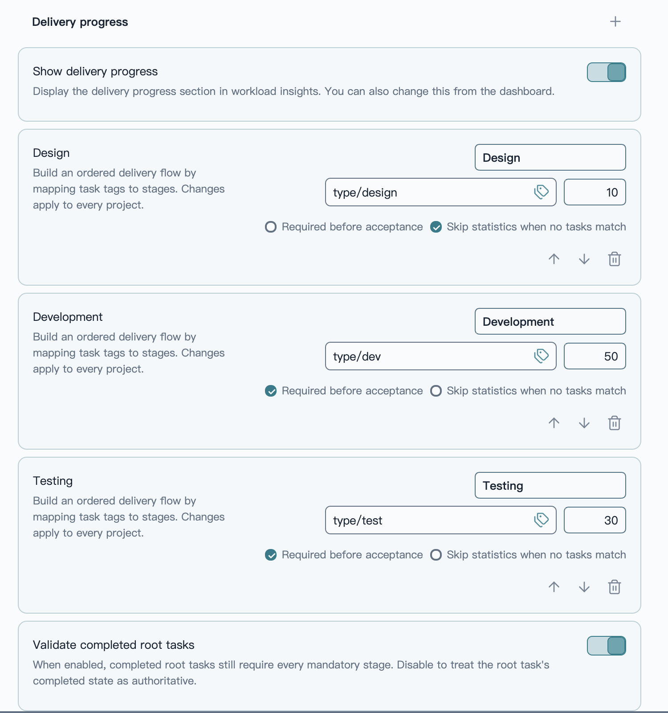

*Each stage card defines its business name, tag entry point, weight, and acceptance meaning. Stage order and rules apply to every project.*

#### Define stage order

A delivery flow contains at least one business stage and supports up to eight. Each stage can be named independently and reordered with the up/down controls. Removing a stage also clears the saved gate date for that stage from project schedules.

A typical software-delivery model might look like:

```text
Discovery       10%  ──→  type/discovery
Development     50%  ──→  type/dev
Testing         30%  ──→  type/test
Acceptance      10%  ──→  derived from root tasks and required stages
```

Stage names cannot be blank or duplicated. Business-stage weights plus the acceptance weight must equal `100%`, or the configuration cannot be saved.

#### Use tags to decide where a subtask belongs

Every business stage needs at least one task tag. Enter tags manually or open the tag picker to choose from tags already used by Project Manager tasks. The picker shows task counts and warns when a tag is already mapped elsewhere.

- Matching ignores a leading `#` and letter case.
- Hierarchical Obsidian tags are supported. Mapping `type/dev` also includes `type/dev/frontend`, `type/dev/backend`, and `type/dev/service`.
- Overlapping tag hierarchies cannot be assigned to different stages. For example, `type/dev` and `type/dev/frontend` cannot belong to two separate stages.
- A subtask that matches two stages, such as both `type/dev` and `type/test`, is not double-counted; it becomes a **type conflict** exception.
- A leaf task that matches no stage tag does not disappear silently; it becomes an **unclassified** exception.

Tags classify business-stage subtasks only. Root tasks represent requirements and need no stage tag; acceptance is derived from the root and its required stages.

#### Decide which stages are acceptance prerequisites

Every business stage has two independent rules:

| Rule | Meaning when enabled |
| --- | --- |
| **Required before acceptance** | All subtasks in this stage must be complete before the root task is ready for acceptance. |
| **Skip statistics when no tasks match** | If the selected projects have no task for this stage, mark it skipped instead of letting a synthetic `0%` reduce total progress. |

Their combinations represent different workflows:

- **Required and not skippable:** a root without a task for this stage produces a missing-prerequisite exception.
- **Required but skippable when empty:** tasks must finish when they exist; a genuinely empty stage does not block acceptance.
- **Not required:** the stage still contributes to stage and total progress but does not block acceptance.

For example, development may be mandatory for every requirement, while design and testing can be optional or skippable according to the team's process.

#### Calculate stages from the complete task tree

Delivery progress always reads complete task trees in the selected projects. Member selection, text search, and task-table filters do not change it. For each root task, PM Insights follows parent-child relationships to the leaf subtasks that carry the real execution work:

1. Exclude cancelled root tasks and their entire descendant trees.
2. Retain archived content only when **Include archived** is enabled.
3. Exclude intermediate nodes that still have children, avoiding duplicate counts.
4. Map eligible leaf tasks to one stage by tag.
5. Calculate `completed tasks ÷ eligible stage tasks` from Project Manager completion states.

Stage completion uses completion state, not a visual progress field. A task showing `80%` while still in progress remains incomplete. Only a Project Manager status configured as complete, or a recorded completion time, counts as completed.

#### Derive acceptance from root tasks

Acceptance has no tag mapping. It asks whether a root requirement has actually reached the delivery standard:

- **Accepted:** the root task is complete and every required stage is ready.
- **Pending acceptance:** all required stages are complete, but the root remains in acceptance, in progress, or another open state.
- **Not ready:** a required stage is missing or still has unfinished prerequisite subtasks.

An “in acceptance” status is not treated as accepted. Only a Project Manager completion status or recorded completion time moves a root into the accepted count.

If your team treats a root task's completed state as authoritative, disable **Validate completed root tasks**. A completed root then counts as accepted immediately. When enabled, PM Insights continues to check for missing prerequisites and completed-too-early exceptions.

#### Combine stages into weighted total progress

Each business stage calculates its own percentage before multiplying by its configured weight. Acceptance participates in the same calculation:

```text
Total delivery progress = Σ(stage completion × stage weight) ÷ effective weight
```

- An empty stage that still participates in statistics contributes `0%`.
- An empty stage with **Skip statistics when no tasks match** does not contribute to the effective weight.
- When there is no eligible root task, the acceptance weight does not create a false `0%`.
- After a stage is skipped, the remaining stage and acceptance weights are normalized automatically; the global configuration does not need temporary edits.

#### Read delivery progress in the dashboard

The dashboard presents delivery in three levels: total progress first, business-stage comparison second, and acceptance status last.

| Area | Meaning |
| --- | --- |
| **Delivery progress · Total** | Weighted portfolio progress across every currently effective stage and acceptance. |
| **Business-stage cards** | Stage percentage, completed task count, eligible task total, and configured weight. |
| **Acceptance** | The darker rail segment is accepted root tasks; the lighter segment is prerequisite-ready roots that are not yet closed. |
| **Delivery exceptions banner** | Summary of unclassified tasks, type conflicts, tasks without a root, missing prerequisites, and completed-too-early roots. |
| **Data quality** | Included subtask count plus unestimated, unassigned, and excluded parent-task counts. |

Business stages also distinguish three no-percentage states:

- **Normal statistics:** eligible tasks exist, so completion is calculated normally.
- **Skipped:** no task matches and the stage allows an empty stage to be skipped.
- **Missing tasks:** no task matches, but the stage is still required for statistics or acceptance.

Searches and filters in the member/task list do not affect delivery progress because delivery always uses complete task trees for the current project scope. The entire delivery-progress section can also be hidden from the dashboard and restored with one action when needed.

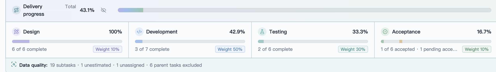

*Configured tags and weights become the stage rails in the dashboard. Total progress, acceptance, gate risk, and data quality share the same current project scope.*

#### Explain progress gaps in the delivery-exceptions modal

A percentage alone cannot explain problems in a task tree. When the delivery model finds work that cannot be classified, traced, or accepted, the dashboard shows a **Delivery exceptions** banner. Its modal lists the source tasks by reason:

- **Unclassified:** no configured delivery-stage tag matches the task.
- **Type conflict:** one task matches more than one stage.
- **No root task:** the hierarchy cannot be followed to an eligible root task.
- **Missing prerequisite:** a root task lacks a stage that is required before acceptance.
- **Completed too early:** a root task is complete while a required stage is not ready.

Unclassified, conflicting, and unlinked subtasks are not forced into a stage, so they cannot contaminate stage percentages. Missing prerequisites and early root completion affect acceptance readiness for the related requirement.

The modal header shows the total and the count for each category. Select a category to focus on it. Every exception record includes:

- task title;
- root-task or subtask role;
- the specific reason;
- project and source-task path;
- an entry point back into Project Manager.

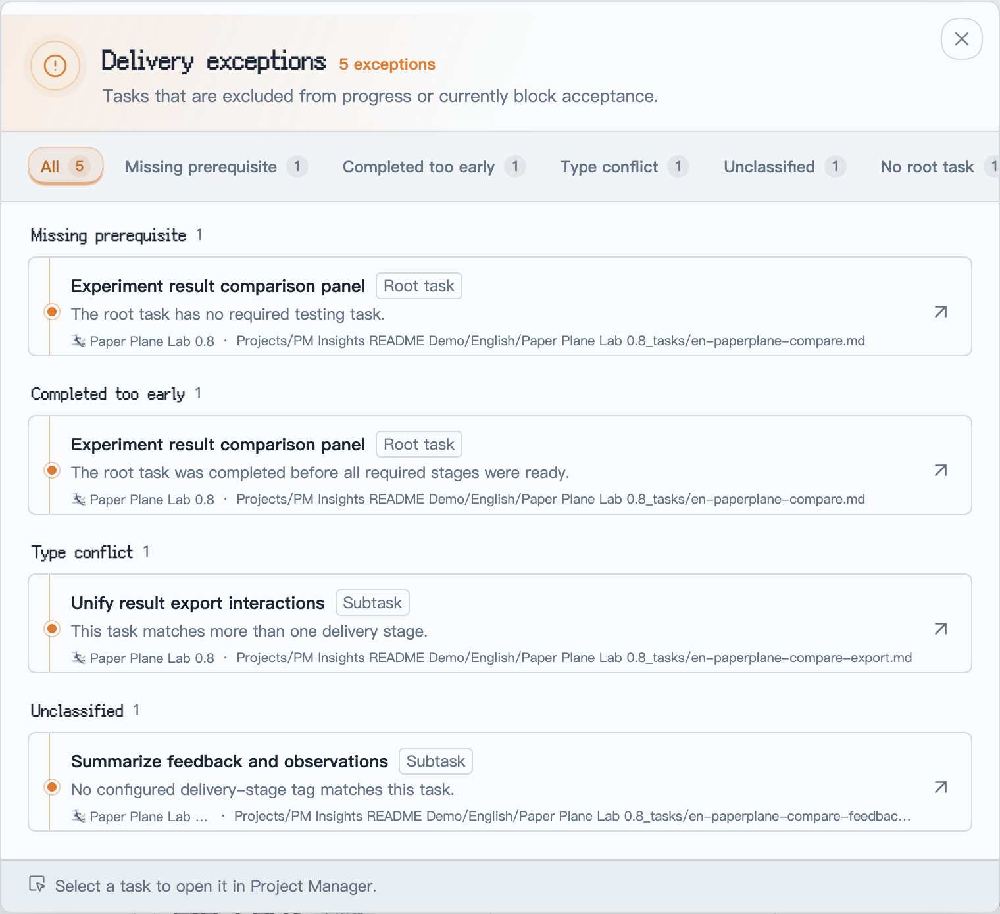

*The fictional “Paper Plane Lab 0.8” data intentionally demonstrates all five hierarchy and stage-classification problems.*

You decide whether completed root tasks still receive full prerequisite validation. When enabled, the complete delivery model is audited. When disabled, root completion is authoritative and a completed root is no longer reported because a prerequisite stage is missing.

Selecting an exception opens the Project Manager task editor above the current modal. Closing the task editor returns to the same exception category and project context, so an investigation can continue without starting over.

### 4. Delivery gates: use planned checkpoints to detect schedule risk

#### Set the project clock and gates on the original baseline

Each project's delivery-gate editor has an **Original baseline** tab and a **Delay plan** tab. The original baseline preserves the delivery schedule that was first agreed for the project:

- project start date;
- one gate date for every business stage;
- acceptance gate date;
- final launch reminder date.

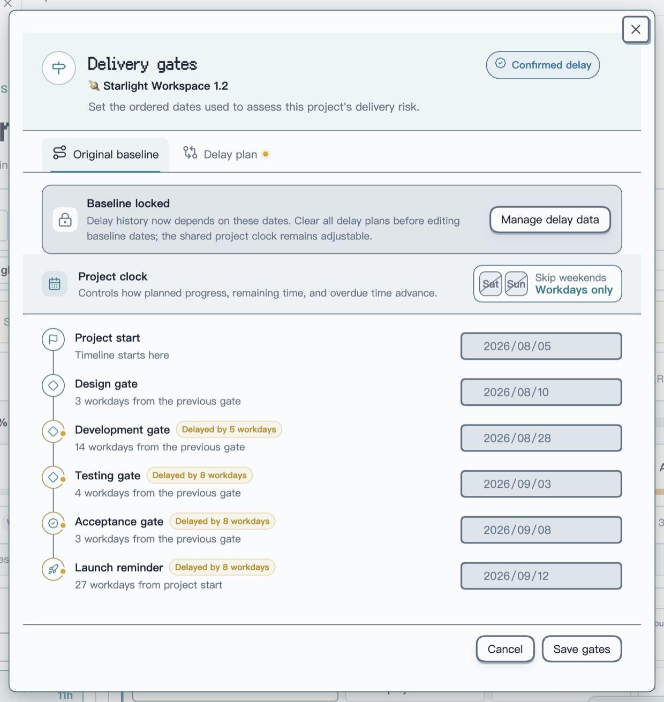

*The Original baseline keeps the first agreed dates intact. Lightweight markers beside affected nodes describe the active delay without changing the date fields.*

The **Project clock** decides whether time advances through weekends. With **Skip weekends** enabled, expected progress, remaining time, overdue time, delay values, and downstream forecasts all use workdays. Disable it to use calendar days. Schedules created before this option was introduced keep their previous calendar-day behavior until the user explicitly changes the rule.

Once delay history exists, the original dates are locked so later edits cannot invalidate saved assessments. To create a different original plan, first use **Manage delay data** to clear every delay plan. The shared project clock remains adjustable while the baseline is locked.

#### Evaluate and confirm a new delivery path with delay plans

The **Delay plan** stays separate from the original baseline. It can express delivery risk, later forecast dates, and the delay assigned to each stage without rewriting the original plan.

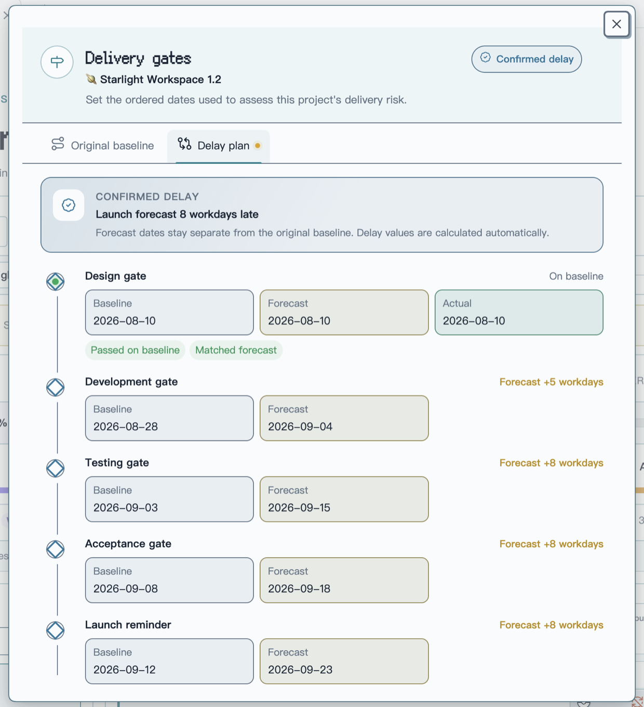

*A confirmed plan places baseline, forecast, and actual outcomes beside each node. The summary at the top reports the final launch delay at a glance.*

During a delay assessment, you can:

- choose a forecast date or enter the number of workdays or calendar days to delay; both inputs stay synchronized;
- use the minus and plus controls to adjust a node one day at a time and cascade the change through later gates using the project clock;
- add an adjustment reason and select **Save assessment** before confirming it from the corresponding activity entry, or confirm the current delay plan immediately without a review step;
- keep only one pending assessment at a time; another assessment can start after the current one is confirmed or withdrawn;
- preserve every revision, including reducing a ten-day delay to five days. Withdrawing an item marks the original record instead of creating another activity entry;
- settle forecasts automatically from actual gate progress. If a five-day delay was forecast but the gate passes three days late, the recovered two days appear without manual input.

An unsaved assessment can be cancelled to return to the previous plan, with confirmation before edited input is discarded. Delay history also preserves gate passes, reopenings, date corrections, and launch records so the current plan remains explainable.

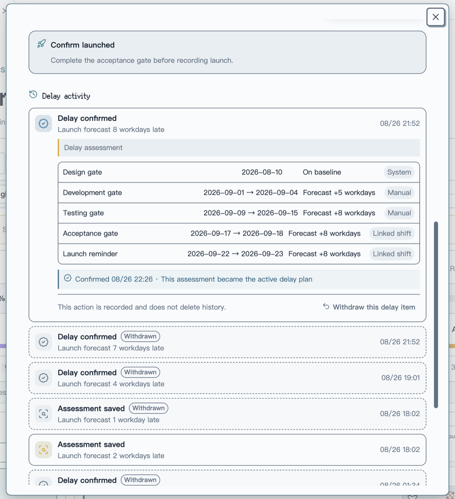

*Delay activity keeps the active item, stage-date changes, change sources, and confirmation time in one record. Withdrawn items remain as compact history instead of generating separate withdrawal entries.*

Open delivery gates from the calendar button in a selected project chip. Every project keeps an independent schedule, and date order is validated before saving. Gate risk compares actual completion with the expected percentage for today using the current project clock. When work has started early or several stages are progressing in parallel, the timeline shows **Ahead** or **Cross-stage** instead of treating that movement as a failure.

A stage gate evaluates its own stage. Acceptance additionally considers tasks that block acceptance. The final launch reminder summarizes the project across all stages and acceptance; it does not depend on a single preceding stage or repeat every task already listed under a stage gate.

#### Use owner bottlenecks to assess delivery capacity

The launch reminder shows total remaining effort, but it does not treat the whole team as one serial resource. Capacity assessment asks one question at every checkpoint: **can the busiest owner finish the remaining work assigned to them before that date?**

| Rule | How it works |
| --- | --- |
| **Different owners run in parallel** | Remaining effort is grouped by person. The busiest owner becomes the checkpoint bottleneck instead of everyone's work being added together. |
| **One owner's work accumulates** | Unfinished work assigned to the same person in earlier and current stages accumulates at the corresponding checkpoint. |
| **Shared work is split** | When a task has several assignees, its remaining effort is divided evenly after member aliases are resolved. |
| **Every checkpoint is evaluated** | Each effective stage gate and the launch date gets its own capacity calculation; the most severe checkpoint determines the final warning. |

For example, if two developers have `60h` and `50h` remaining in the development stage, the stage has `110h` of remaining effort but a `60h` bottleneck—not a serial `110h` load. With five calendar days before the development gate and eight available hours per person per day, each person has `40h` of capacity, leaving the bottleneck owner `20h` short.

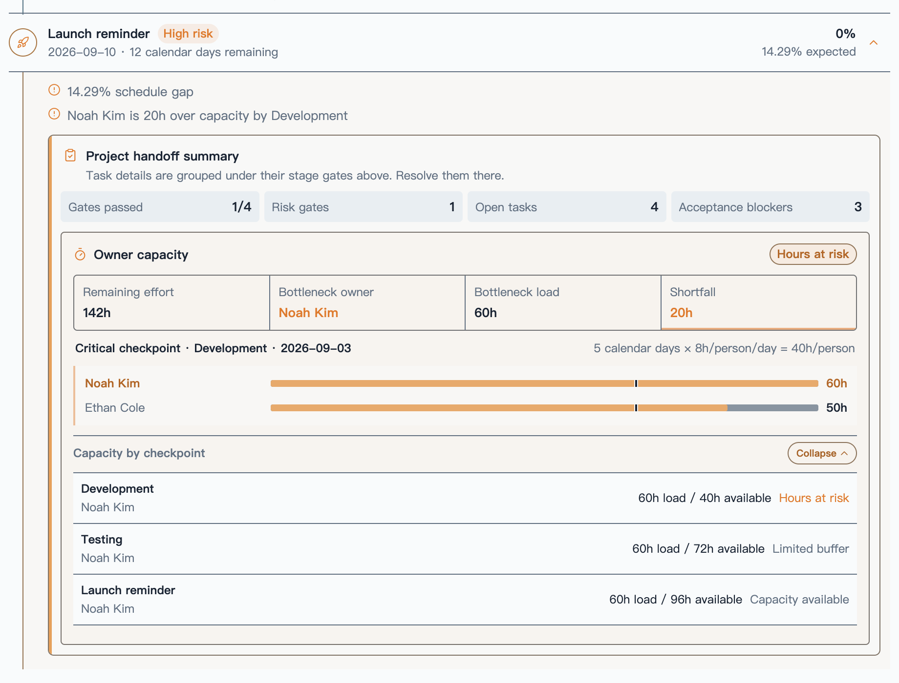

*The launch reminder separates team totals from personal bottlenecks. The 142h shown also includes Lia Park's 32h of testing work; Noah Kim's 60h and Ethan Cole's 50h run in parallel, so Development compares Noah's 60h against 40h of personal capacity.*

A load above available capacity is high risk, while utilization of 80% or more calls for attention. Unestimated, unassigned, or unmapped work is not silently ignored; it appears separately as a planning blind spot. Configure **Hours per person per workday** and **Hours per person per calendar day** under **Settings → PM Insights → Gate risk rules**. Existing settings remain compatible and default to eight hours per person.

The launch date is a project-rhythm reminder, not a second definition of delivery completion. The acceptance result remains the final delivery standard.


*The dashboard keeps only the most important counts, related project, and nearest gate. Select the banner to open the full risk timeline.*

#### Let the user decide whether due dates are checked

Task due dates can contribute to gate risk, but they are not mandatory.

When **Check task due dates** is enabled, gate risk checks for:

- unfinished execution tasks without a due date;
- overdue tasks;
- tasks scheduled after their stage gate.

When disabled, PM Insights still evaluates gate dates, expected progress, schedule gaps, and acceptance blockers; task due dates simply stop affecting risk. The switch is available both in settings and directly in the gate-risk modal.

Root tasks represent requirements in this model, so they do not need their own estimate. Estimate completeness is evaluated primarily on the execution subtasks beneath each root.

#### Read the evidence in the risk timeline

The **Delivery gate risk** modal places project rhythm and supporting evidence in one view:

- switch among selected projects and inspect each schedule;
- compare actual completion with expected completion;
- when a project has a confirmed delay, compare the original plan, delayed date, forecast delay, and remaining time directly on each stage timeline;
- distinguish not started, on track, attention, high risk, overdue, passed, skipped, ahead, and cross-stage states;
- read specific reason chips such as overdue task, past gate, stage progress gap, unestimated subtask, unassigned, or blocking acceptance;
- open a risk task in Project Manager;
- read a concise project-level wrap-up under the launch reminder instead of a repeated task list.

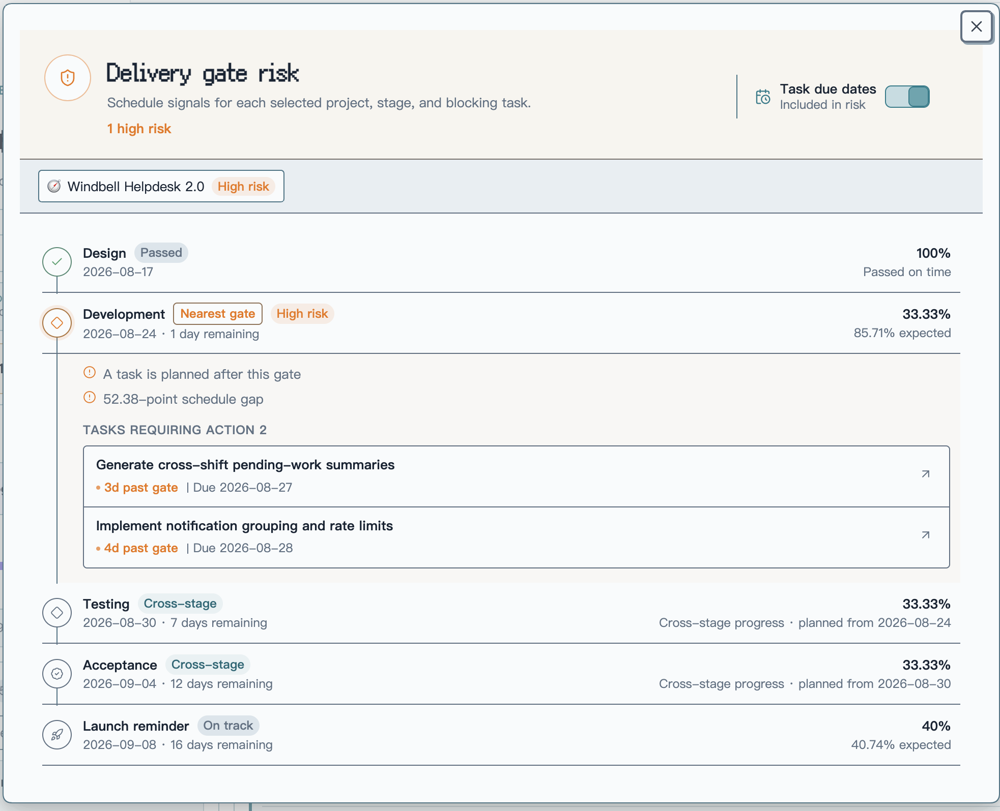

*The modal organizes a complete gate timeline by project. Passed stages remain visually neutral, high-risk stages expand their reasons and task evidence, and the due-date switch remains available at the top.*

Neutral and healthy states use restrained colors. Warning color is reserved for conditions that actually need attention.

### 5. Task traceability: move from a metric back to the source task

#### Combine filters and adjust the task table

The member task list is an investigation surface rather than a static report:

- search by task title;
- combine multi-select project, status, and priority filters;
- reset every filter in one action;
- drag a divider to resize columns, use arrow keys for precise adjustment, or double-click to restore the default layout;
- keep the task-title column fixed on narrow screens while the remaining fields scroll horizontally.

#### Return to Project Manager to act

- Select a task title to open the Project Manager task editor above the dashboard.
- Select a project name to open its Project Manager page in a new tab.

PM Insights never copies or rebuilds task data. It passes the current task and project to Project Manager's own task editor. Task type, parent, status, priority, dates, assignees, stage tags, description, subtasks, time logs, and source path still come from the same Project Manager task.

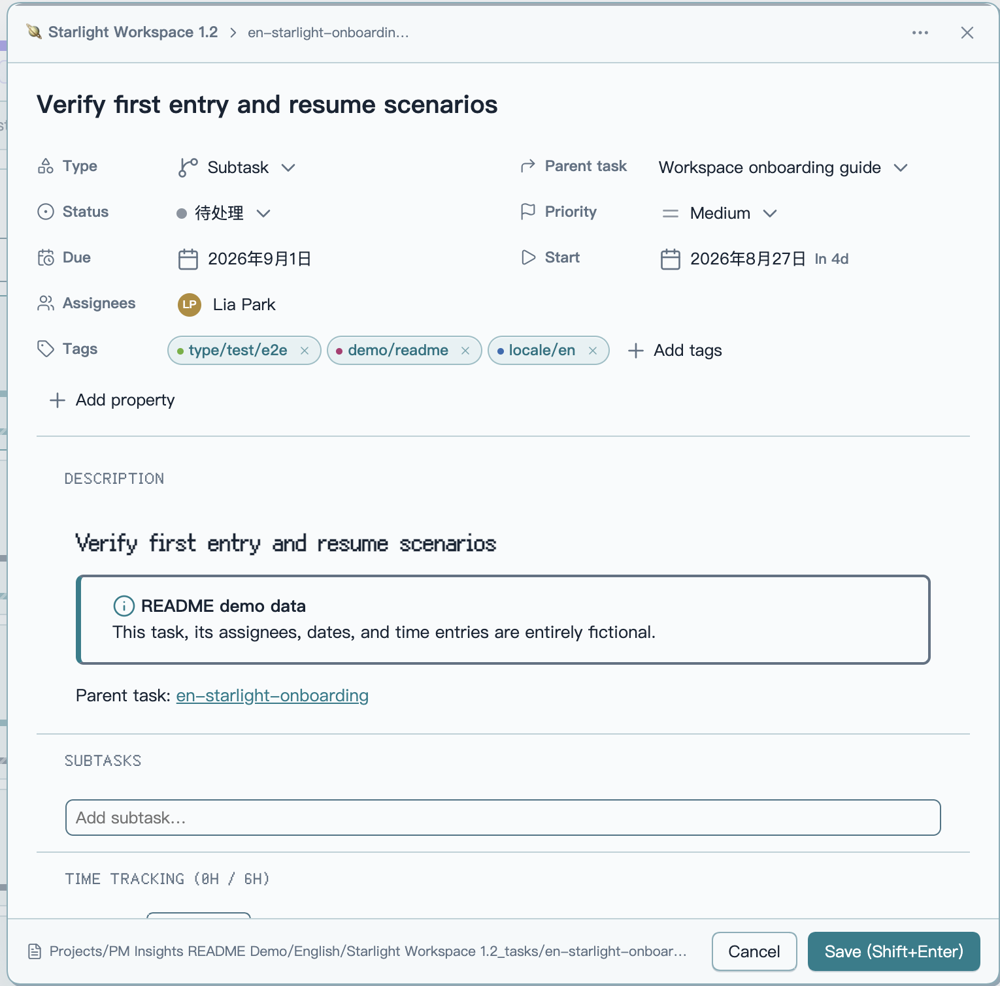

*Project Manager provides the task editor, and the source path at the bottom continues to the underlying task note. Closing it returns to the same PM Insights project scope, member, and filter context.*

Opening task details directly is currently supported with Project Manager `1.8.x` and `2.1.x`. Any edits inside that window are handled by Project Manager; PM Insights itself still performs no task-note writes.

## V. Statistical rules and data boundaries

The interface presents the result. These rules keep that result explainable with one consistent model across views.

### 1. Workload and task hierarchy

- Workload counts leaf subtasks by default. Even if a root has no children, an explicit `type: task` is still treated as a parent and excluded. When type metadata is missing, `parentId` relationships are used to reconstruct the hierarchy where possible.
- With **Count parent tasks** enabled, workload counts parent tasks and excludes their children instead.
- **Count parent tasks** affects workload only; it never changes delivery-progress rules.

### 2. Status, archives, and data quality

- Cancelling a root task excludes its entire task tree from delivery progress.
- Completed tasks—and archived tasks when included—retain planned and logged hours but no longer add remaining hours.
- **Include archived** controls whether archived content participates.
- Unassigned and unestimated work remains visible as a data-quality signal.

### 3. Empty stages and effective weight

- A skipped empty stage does not lower total progress; the remaining effective weights are normalized automatically.

### 4. Local data and read-only analysis

Project Manager Insights reads Project Manager metadata from the local Vault only. It does not upload project or member information, modify project or task notes, or change Project Manager's data model. The current plugin has no network integration.

## VI. Getting started

### 1. Requirements

You will need:

- Obsidian `1.7.2` or later;
- the [Project Manager](https://github.com/stepankropachev/obsidian-pm) plugin;
- at least one Project Manager project.

### 2. Install the plugin

Install [Project Manager Insights from the official Obsidian Community directory](https://community.obsidian.md/plugins/project-manager-insights), or open **Settings → Community plugins → Browse**, search for **Project Manager Insights**, then select **Install** and **Enable**.

Whenever you open PM Insights, it checks whether Project Manager is installed and enabled. If the dependency is unavailable, confirming the reminder opens Project Manager's official Obsidian plugin page, where Obsidian handles installation and enabling; PM Insights never downloads or installs dependencies itself.

### 3. Start analyzing

After installation:

1. Select the **PM Insights** ribbon icon, or run **PM Insights: Open workload insights** from the command palette.
2. Select one or more projects.
3. Select a member, then use the gauge beside their name to open the personal delivery brief; select a delivery window, project workload, or capacity checkpoint to filter the related source tasks.
4. Open **Settings → PM Insights** to configure member aliases, delivery stages, weights, acceptance rules, and gate-risk behavior.
5. When you need schedule analysis, configure each project's gate dates from its chip in the current-scope bar.

## VII. Development and verification

```bash
# Start the development build
npm run dev

# Type-check, lint, test, review, and create a production build
npm run check
```

## VIII. Thanks and support

Thank you to [Project Manager](https://github.com/stepankropachev/obsidian-pm) for providing an open and dependable project/task data foundation, and to everyone who uses, tests, shares, and improves Project Manager Insights.

### 1. Report problems and ideas

If a statistic does not match your expectation, the interface behaves incorrectly, or you would like another project-management perspective, open a [GitHub Issue](https://github.com/CoffeeCheese/obsidian-pm-insights/issues). To make diagnosis faster, please include:

- Obsidian, Project Manager, and Project Manager Insights versions;
- steps that reproduce the behavior;
- a screenshot or minimal example with project and member privacy removed;
- the result or rule you expected.

### 2. Support the project

If PM Insights helps you understand team workload and delivery more clearly, you can support ongoing maintenance by:

- starring the [GitHub repository](https://github.com/CoffeeCheese/obsidian-pm-insights);
- sharing the plugin with other Project Manager users or teams;
- describing real workflows that can improve the statistical model and delivery rules;
- testing new releases and reporting what you find.

Every issue, use case, and recommendation helps make this project more dependable. Made for people who want to see team delivery clearly without disturbing the workflow that already works. ☕

## IX. License

[MIT](LICENSE)
