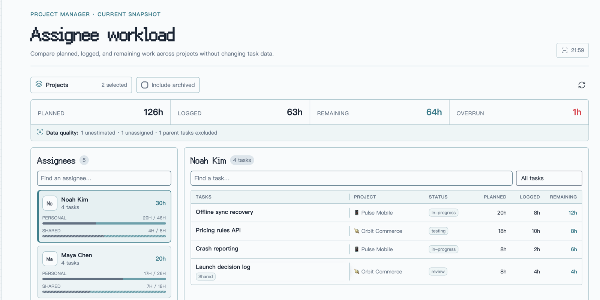

<div align="center">
  <p><code>PROJECT MANAGER · WORKLOAD COMPANION</code></p>
  <h1>✦ PM Insights ✦</h1>
  <p><strong>藏在 Obsidian Vault 里的小小工作量观测站。</strong></p>
  <p>选中项目，看看团队的工时，再顺着每个数字找到具体任务。</p>
  <p><a href="README.md">English</a> · <strong>简体中文</strong></p>
</div>



<p align="center"><sub>截图在 <code>dev-test</code> 库中使用 Pixel 主题和虚构数据生成，不包含任何真实项目数据。</sub></p>

## ✦ 把项目工时装进一个小窗口

PM Insights 将 [Project Manager](https://github.com/stepankropachev/obsidian-pm) 创建的笔记整理为清晰的跨项目工作量视图。计划、已登记、剩余和超出工时会集中到同一处，还可以从团队快照一路查看构成每个数字的具体任务。

> [!NOTE]
> **只读约定：** PM Insights 会读取 Project Manager 数据，但绝不会修改项目或任务笔记。

## ✦ 跟着信号一路看下去

`项目` → `团队快照` → `成员` → `任务`

1. 勾选任意多个 Project Manager 项目。
2. 查看团队的计划、已登记、剩余和超出工时。
3. 选择成员，分开核对个人工作与共享工作。
4. 搜索或筛选任务，确认每一份工时来自哪里。

## ✦ 认识这块像素面板

| 像素窗口 | 它告诉你什么 |
| --- | --- |
| `团队 HUD` | 汇总所选项目的计划、已登记、剩余和超出工时。 |
| `成员卡片` | 展示每个人的任务数量和工作量轨道，并分开统计个人与共享工作。 |
| `任务抽屉` | 按任务搜索，查看所属项目、状态、计划、已登记和剩余工时。 |
| `质量提示` | 友好提示未估算、未分配以及已排除父任务等数据问题。 |

视图变窄时，任务列会保持固定，其余字段可以横向滚动。界面支持英文与简体中文，并从当前 Obsidian 主题中获取颜色。

## ✦ 像素背后的统计规则

| 指标 | 计算方式 |
| --- | --- |
| 计划 | 汇总纳入统计任务的预估工时。 |
| 已登记 | 汇总任务的工时登记记录。 |
| 剩余 | 对未完成、已估算且未归档的任务计算 `max(计划 - 已登记, 0)`。 |
| 超出 | 对已估算的任务计算 `max(已登记 - 计划, 0)`。 |

为了让快照保持可信：

- 共享任务只计入团队总数一次，同时出现在每位负责人的 **共享** 工作条中。
- 存在子任务的父任务不参与工时汇总，避免父子任务重复计算。
- 已完成任务以及勾选纳入统计的已归档任务会保留计划与已登记工时，但剩余工时为零。
- 未分配和未估算任务不会悄悄消失，而是继续作为数据质量提示展示。
- 成员别名可以将不同写法合并到同一个规范名称，不会改动源笔记。

## ✦ Vault 准备好就可以出发

- Obsidian `1.7.2` 或更高版本。
- 已安装 [Project Manager](https://github.com/stepankropachev/obsidian-pm) 插件，并至少创建了一个 Project Manager 项目。

PM Insights 目前仍是早期预览版本，尚未发布到 Obsidian 社区插件目录。

点击侧边栏中的 **PM Insights** 图标，或在命令面板运行 **PM Insights: 打开工作量洞察** 即可开始使用。在项目选择器中勾选项目并选择成员；需要切换语言或配置成员别名时，前往 **设置 → PM Insights**。

## ✦ 开发与检查

启动开发构建：

```bash
npm run dev
```

运行类型检查、测试和生产构建：

```bash
npm run check
```

## ✦ 安静的隐私约定

PM Insights 只读取本地 Vault 中的 Project Manager 元数据，不会编辑项目或任务笔记；当前插件也没有任何网络集成。

## 许可证

[MIT](LICENSE)
