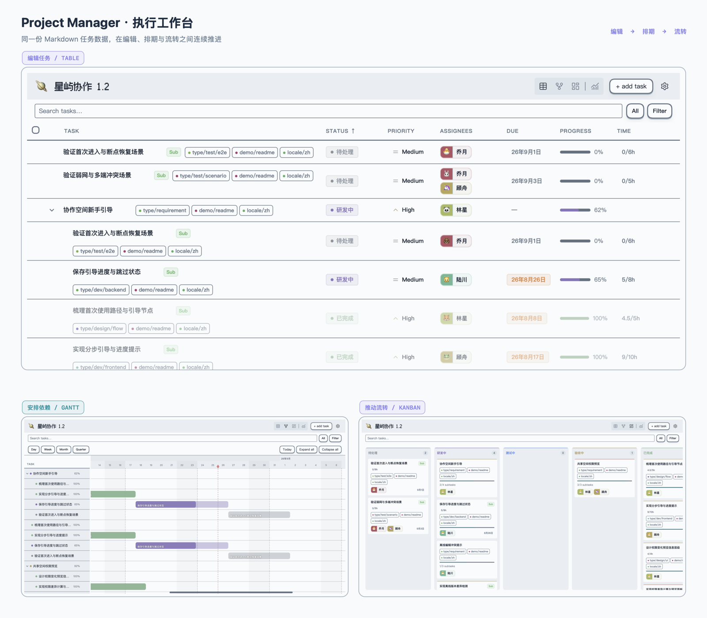
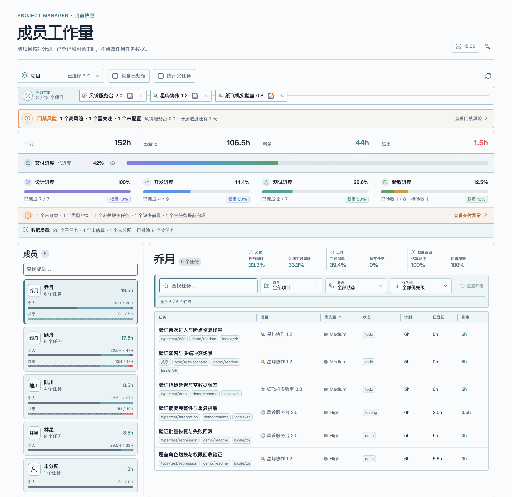
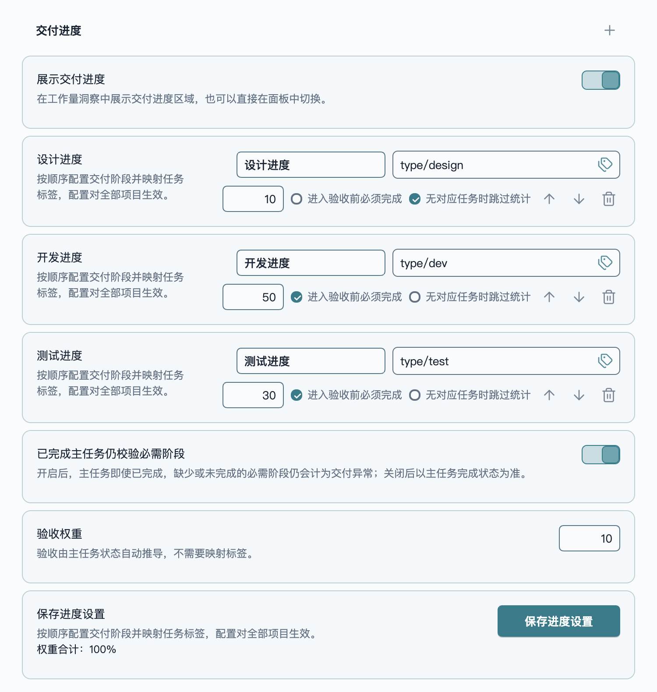
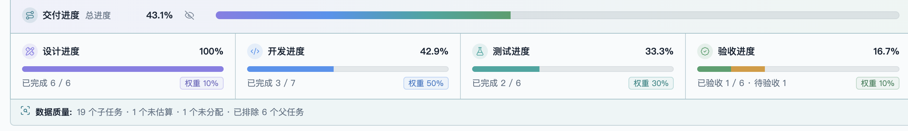
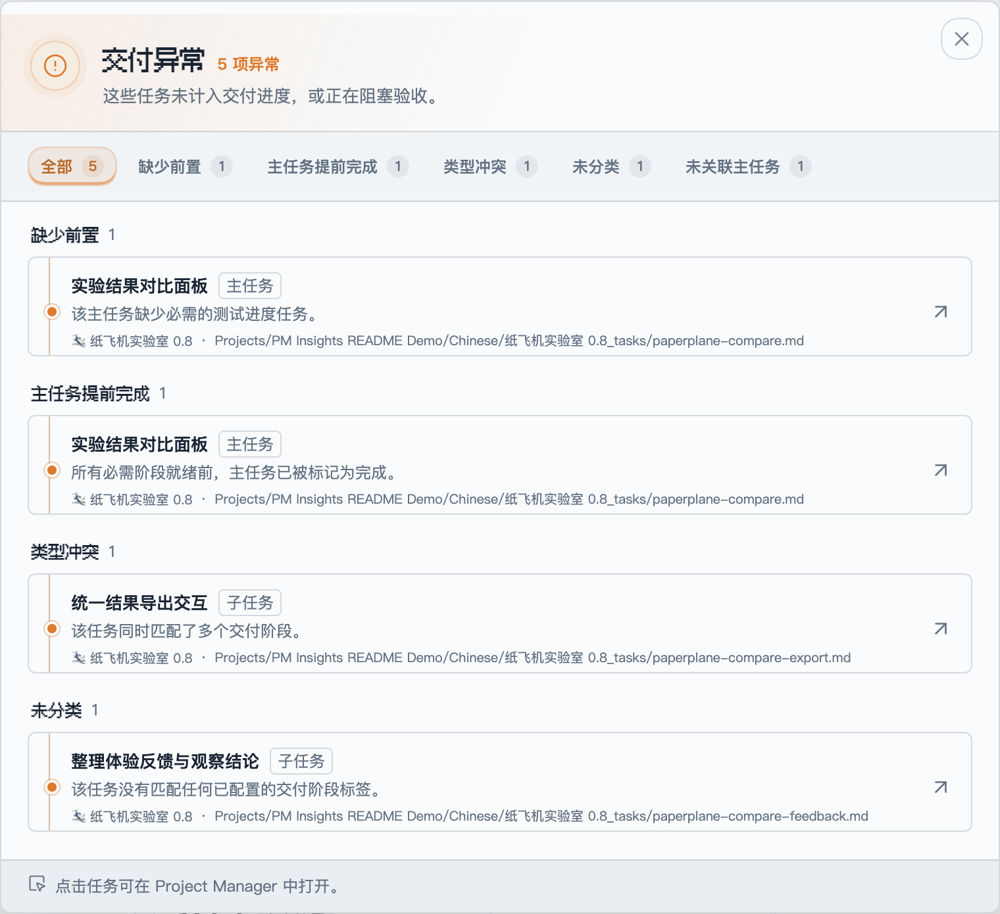
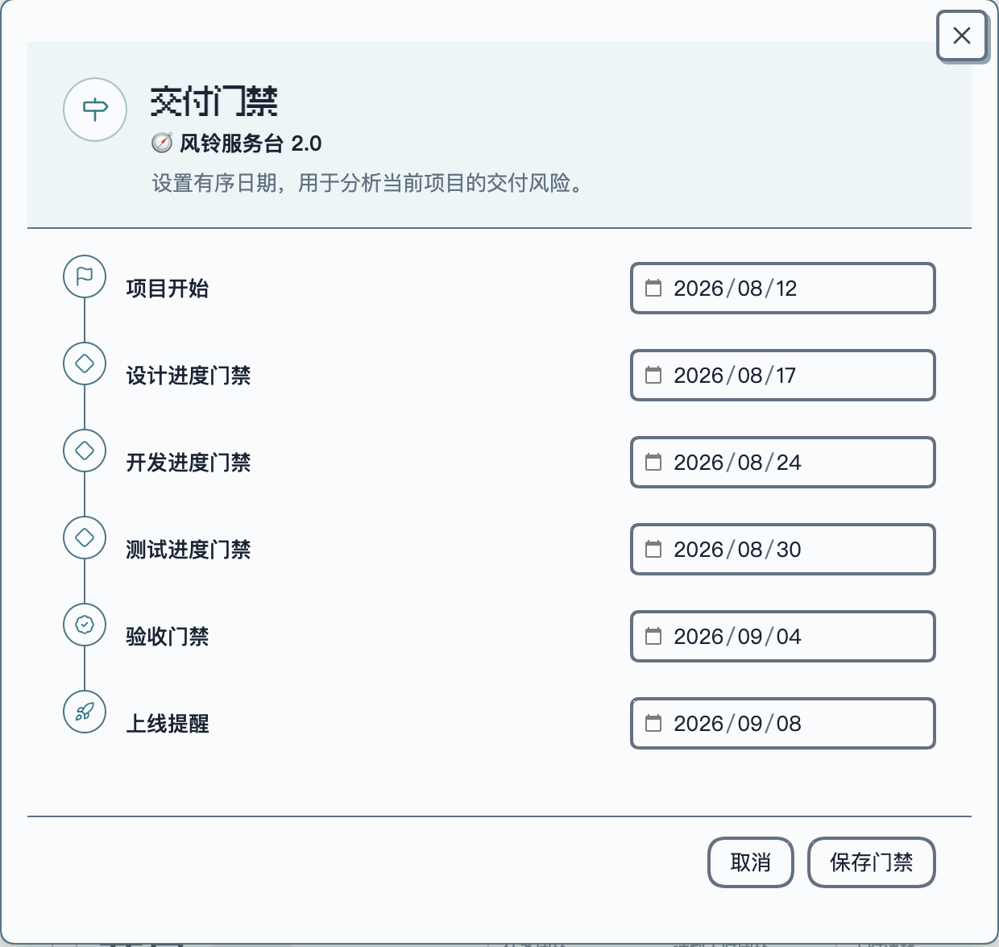
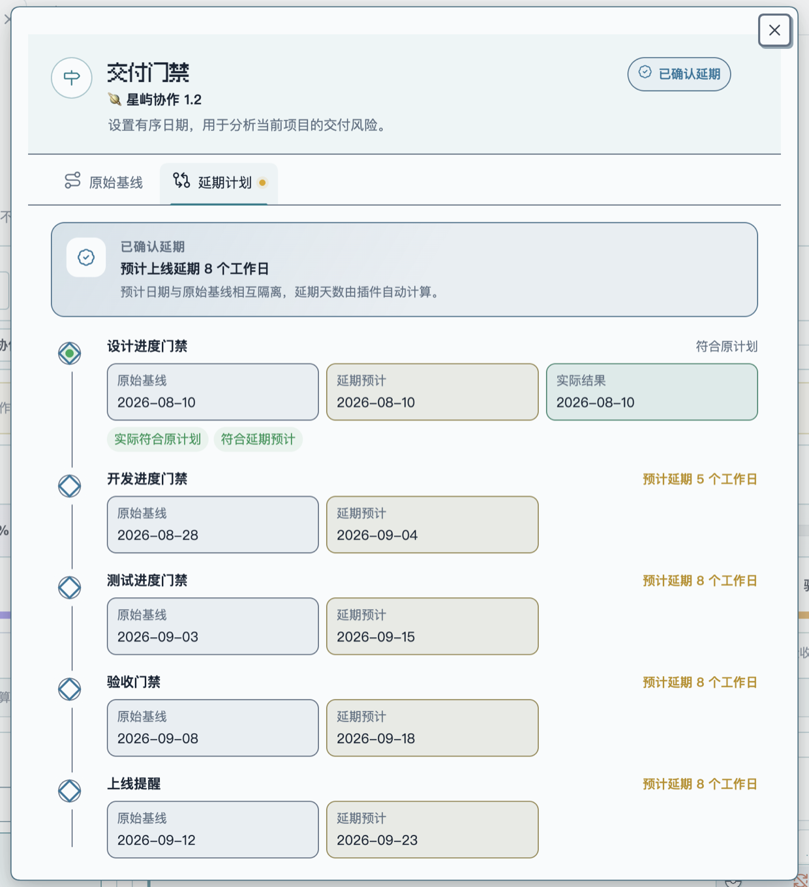
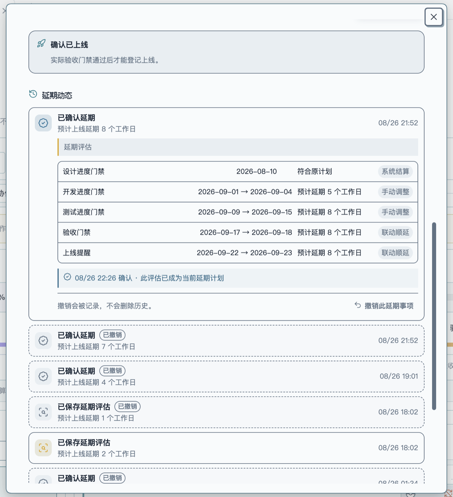
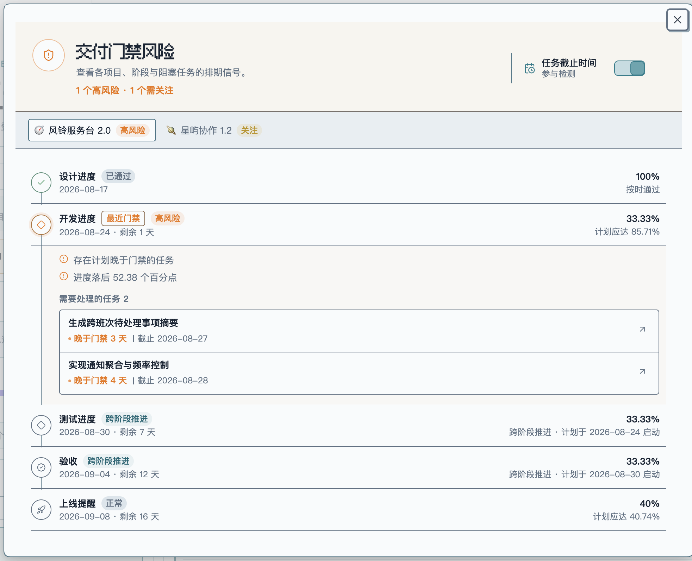
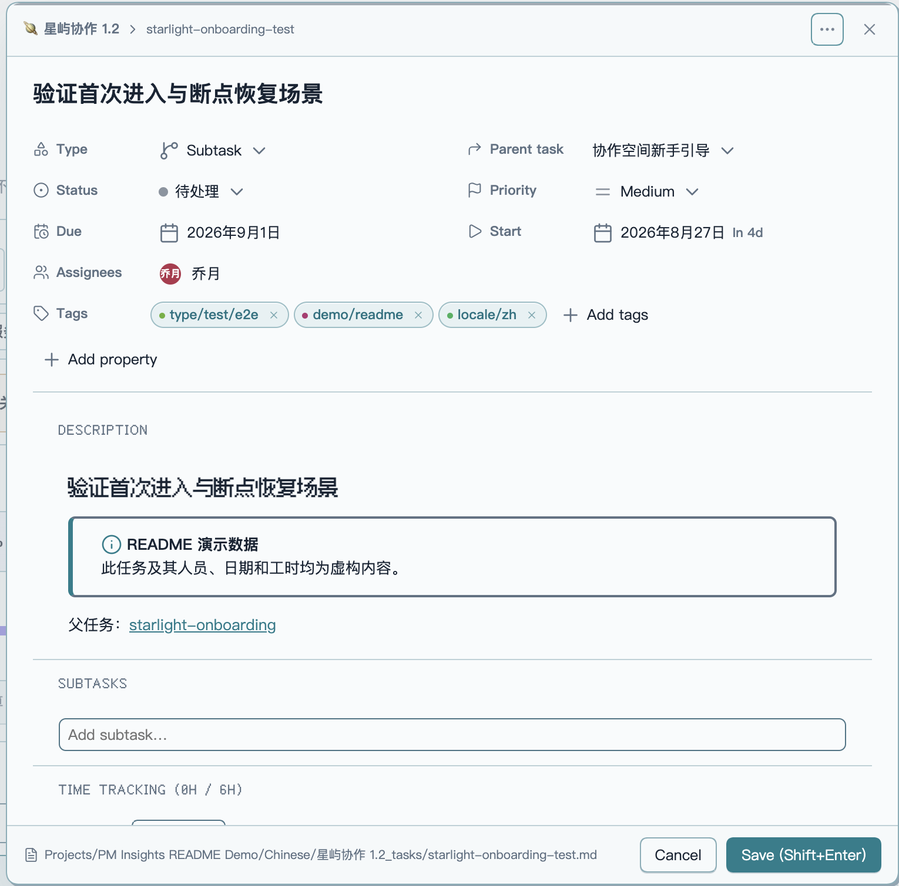

`OBSIDIAN · PROJECT MANAGER COMPANION`

# 🫧 Project Manager Insights ✨

**从个人执行到团队交付，让 Project Manager 数据形成可追溯的项目洞察。**

作为 Project Manager 的只读数据增强层，基于其项目、任务、层级、标签与状态扩展跨项目工作量、交付进度和排期风险视角，不改变任何任务笔记。

[](https://community.obsidian.md/plugins/project-manager-insights)
[](https://github.com/CoffeeCheese/obsidian-pm-insights/releases)
[](https://github.com/CoffeeCheese/obsidian-pm-insights/releases)


[**从 Obsidian 安装**](https://community.obsidian.md/plugins/project-manager-insights) · [版本发布](https://github.com/CoffeeCheese/obsidian-pm-insights/releases) · [反馈问题](https://github.com/CoffeeCheese/obsidian-pm-insights/issues)

[English](README.md) · **简体中文**

## 一、插件概述：从个人执行看见团队交付

[Project Manager](https://github.com/stepankropachev/obsidian-pm) 是本插件的数据基础与任务操作层。它将项目和任务保存为 Vault 内的 Markdown 文件与 YAML 元数据，并提供表格、甘特图、看板、任务层级、依赖、排期、负责人和工时等项目管理能力。

Project Manager Insights 是建立在这些数据之上的**只读洞察增强层**。它不替代 Project Manager，也不会创建另一套项目数据，而是继续解析 Project Manager 已有的元数据属性和任务关系，将原本面向单个项目、单条任务的执行信息，扩展为更多项目管理视角。

### 1. 两个插件如何分工

| 层级 | 主要职责 |
| --- | --- |
| **Project Manager：数据与执行层** | 创建和维护项目、主任务与子任务，并保存类型、父子关系、状态、优先级、日期、进度、估时、工时、负责人、标签及自定义字段。 |
| **Project Manager Insights：洞察增强层** | 只读汇总上述数据，在不改变原有工作流的前提下，补充跨项目、成员、交付、验收、数据质量和排期风险等分析视角。 |

### 2. 从 Project Manager 执行工作台到 PM Insights 洞察主页

同一份 Markdown 项目数据贯穿两个工作台：团队先在 Project Manager 中创建任务、安排依赖并推动状态流转；PM Insights 再以只读方式汇总这些执行记录，在工作主页集中呈现跨项目进度、交付风险与数据质量。

<table>
  <tr>
    <td width="53%" valign="top">
      <a href="docs/assets/obsidian-pm-work-surfaces.zh-CN.png">
        
      </a>
    </td>
    <td width="47%" valign="top">
      <a href="docs/assets/pm-insights-overview-0.3.1.zh-CN.png">
        
      </a>
    </td>
  </tr>
  <tr>
    <td align="center" valign="top">
      <strong>数据与执行来源 · Project Manager</strong><br>
      <sub>编辑任务、安排依赖、推动状态流转<br><a href="https://github.com/stepankropachev/obsidian-pm">了解 Project Manager</a></sub>
    </td>
    <td align="center" valign="top">
      <strong>只读洞察主页 · PM Insights</strong><br>
      <sub>汇总项目范围、团队交付与计划风险<br><a href="https://community.obsidian.md/plugins/project-manager-insights">从 Obsidian 安装</a></sub>
    </td>
  </tr>
</table>

<p align="center"><sub>同一份 Markdown / YAML 数据：左侧负责创建与维护，右侧负责只读解析与来源追溯。点击图片可查看完整尺寸。</sub></p>

> **两个插件的交接点：** Project Manager 产生可信的执行数据，PM Insights 将其还原为可追溯的团队交付信号，同时不接管源任务。

### 3. 如何从元数据扩展观察维度

```text
Project Manager 数据源
项目文件 · 任务文件 · YAML 元数据
类型 · 层级 · 状态 · 日期 · 工时 · 负责人 · 标签
                    │
                    ▼ 只读解析与关联
        Project Manager Insights
                    │
                    ├── 从单个项目扩展到跨项目范围
                    ├── 从个人任务扩展到团队工作量
                    ├── 从任务状态扩展到阶段交付与验收
                    ├── 从排期日期扩展到门禁风险
                    └── 从统计结果返回 Project Manager 源任务
```

### 4. 增强后的项目管理视角

选择一个或多个 Project Manager 项目后，PM Insights 会进一步提供：

- **项目范围视角：** 明确当前统计哪些项目，并在所有分析模块中保持相同范围。
- **团队与个人视角：** 从跨项目工作量进入成员任务、共享任务和个人交付账本。
- **交付与验收视角：** 依据任务层级、阶段标签和任务状态推导阶段完成度与需求验收结果。
- **数据质量视角：** 识别未估时、未分配、未分类、类型冲突和缺少前置等问题。
- **计划与风险视角：** 对比阶段实际进度、计划应达比例、任务截止时间和项目门禁日期。
- **来源追溯视角：** 从面板数字、异常和风险任务直接返回 Project Manager 的项目或任务详情。

这些视角共用 Project Manager 的同一份本地数据。每个数字和提醒都能回到产生它的项目与任务，不会因为分析而改变源数据。

> [!NOTE]
> 请先安装并使用 Project Manager 建立项目和任务。Project Manager Insights 负责增强观察和判断，不会修改项目笔记、任务笔记或 Project Manager 的数据结构。

本文按照由简入深的顺序展开：

```text
插件定位
   ↓
功能全景
   ↓
数据与任务树的设计逻辑
   ↓
六项核心功能
   ↓
统计边界与快速上手
```

## 二、功能全景：一眼看清能解决什么问题

| 洞察 | 回答的问题 |
| --- | --- |
| **项目范围** | 当前面板究竟统计了哪些项目？ |
| **团队工作量** | 团队计划了多少、已经投入多少、还剩多少、超出了多少？ |
| **成员洞察** | 每位成员承担了什么，个人工作和共享工作分别有多少？ |
| **交付进度** | 工作推进到了哪个阶段，距离验收还有多远？ |
| **交付异常** | 哪些任务没有被正确纳入阶段，或正在阻塞验收？ |
| **门禁风险** | 当前进度是否跟得上阶段门禁和最终上线计划？ |
| **数据质量** | 哪些执行任务仍缺少估时、负责人或截止时间？ |
| **任务追溯** | 哪个源任务导致了这项统计或提醒？ |

这一章先给出插件能够回答的问题；下一章再解释这些结果如何从 Project Manager 数据中推导出来。

## 三、设计逻辑：如何从任务推导项目洞察

PM Insights 不会把所有任务简单地放在一起计数，而是先还原 Project Manager 的任务树，再根据任务层级、标签和状态分别计算：

```text
Project Manager 项目
        │
        ▼
   读取完整任务树
        │
        ├── 主任务（需求维度）
        │      ├── 判断需求是否完成
        │      ├── 检查必需阶段是否就绪
        │      ├── 推导验收进度与验收阻塞
        │      └── 识别缺少前置或提前完成
        │
        └── 子任务（执行维度）
               ├── 根据标签归入交付阶段
               ├── 根据状态计算阶段完成比例
               ├── 汇总负责人、估时与登记工时
               └── 检查排期、门禁与数据质量
```

四类信息分别承担不同作用：

| 数据来源 | 在洞察中的作用 |
| --- | --- |
| **主任务** | 代表一个需求或交付目标，用于验收进度、前置阶段完整性和需求闭环判断。 |
| **子任务** | 代表实际执行工作，用于阶段进度、成员工作量、工时、排期与风险统计。 |
| **任务标签** | 将子任务映射到对应交付阶段；未匹配或同时匹配多个阶段时会形成交付异常。 |
| **任务状态** | 判断任务是否完成、取消或归档，并据此决定是否计入进度、剩余工时和风险。 |

因此，同一个项目会同时形成两条互补的观察路径：**从子任务看团队正在怎样执行，从主任务看需求是否真正达到验收和交付标准。** 主任务代表需求维度，不要求自身承担子任务的工时统计；子任务则负责反映具体投入和阶段推进，避免父子任务重复计算。

界面支持简体中文与英文，颜色跟随当前 Obsidian 主题；在窄屏环境下，任务标题列会保持可见，其余字段可以横向查看。

## 四、核心功能：从范围确认到任务追溯

以下功能共用同一条分析链路：先确定项目范围，再从团队工作量进入个人执行，随后结合任务树观察交付进度、交付异常和门禁风险，最后回到 Project Manager 的源任务处理问题。

### 1. 项目范围管理：明确当前正在分析什么

#### 选择与调整项目

你可以自由组合 Vault 中的多个 Project Manager 项目。当前选择会持续显示在面板顶部，避免在查看跨项目数据时失去统计边界。

- 搜索并同时选择多个项目。
- 直接从项目标签上移除不再关注的项目。
- 从 Project Manager 项目页进入 PM Insights，并自动聚焦对应项目。

#### 保持统一统计边界

团队工作量、成员洞察、交付进度、交付异常和门禁风险始终共用同一份项目范围。切换或移除项目后，所有视图会同步更新，避免不同模块使用不同数据范围。

### 2. 团队工作量：从全局投入进入个人执行

#### 查看团队快照

团队快照会将选中项目汇总为四项直接可用的工作量指标：

| 指标 | 计算方式 |
| --- | --- |
| **计划** | 汇总纳入统计任务的预估工时。 |
| **已登记** | 汇总任务的工时登记记录。 |
| **剩余** | 对未完成、已估时且未归档的任务计算 `max(计划 - 已登记, 0)`。 |
| **超出** | 对已估时任务计算 `max(已登记 - 计划, 0)`。 |

#### 拆解成员与共享任务

从团队总览选择一位成员后，可以分别查看他的个人任务和共享任务。共享任务会出现在每位相关成员名下，但在团队汇总中只计算一次；未分配和未估时的任务也不会因为数据不完整而被隐藏。

#### 统一成员名称

成员别名可以把任务中不同的姓名写法统一为一个统计名称。例如将“小明”“Chen”和“Ming”归并到“陈小明”，原任务内容不会发生变化。

### 3. 个人交付账本：理解执行质量

#### 用三组指标观察个人执行

每位成员旁边都有一组紧凑的个人交付账本，围绕三个问题组织六项指标：任务是否顺利闭环、投入是否符合计划、基础数据是否足以支撑判断。

| 分组 | 指标 | 计算方式 |
| --- | --- | --- |
| **交付** | 任务闭环 | 已完成且未取消任务 ÷ 全部未取消任务。 |
| **交付** | 计划工时闭环 | 已完成任务的计划工时 ÷ 全部已估算工时。 |
| **工时** | 工时消耗 | 已估算任务的登记工时 ÷ 对应计划工时。 |
| **工时** | 超支任务 | 已开工且登记超过计划的任务 ÷ 全部已开工且有估算的任务。 |
| **数据基础** | 估算命中 | 登记工时处于估算 ±20% 范围内的已完成、已开工任务 ÷ 全部有效样本。 |
| **数据基础** | 估算覆盖 | 已填写计划工时的未取消任务 ÷ 全部未取消任务。 |

#### 正确理解无样本状态

显示破折号 `—` 代表当前没有有效样本，并不等于结果为零。

### 4. 交付进度：观察阶段推进与验收结果

交付进度不是简单地把全部任务做一次完成率计算。它从所选项目的完整任务树出发，用子任务观察每个业务阶段的实际推进，再用主任务判断需求是否具备验收条件，最后按照团队配置的权重汇总为总交付进度。

每张阶段卡片还会依据项目门禁日期，将实际进度与当前预计进度放在一起比较：预计位置会直接标记在进度轨道上，并明确显示领先或落后的百分点。跨项目查看时，业务阶段的预计进度按相关任务数加权，验收阶段按主任务数加权；只要相关项目仍缺少门禁日期，PM Insights 就会提示补齐排期，而不会用不完整数据展示可能误导的偏移量。

这套视图主要回答四个问题：

- 当前设计、开发、测试或其他自定义阶段分别完成了多少？
- 已经做完前置工作的需求，是否真正进入或通过验收？
- 哪些任务因为标签或层级问题没有进入阶段统计？
- 多个项目放在一起时，整体交付状态如何被统一解释？

交付阶段不是写死的固定模板。PM Insights 提供一套全局阶段模型，你可以按照团队当前的研发、内容、运营或其他交付流程，定义阶段顺序、任务归类方式、验收条件和最终权重。保存后的模型会应用到所有项目，而每个项目仍然保留自己的任务数据和门禁日期。

#### 关键节点图谱

```text
设置团队交付模型
        │
        ├── 阶段顺序 ─────── 决定工作流先后关系
        ├── 标签映射 ─────── 将叶子子任务归入唯一阶段
        ├── 验收前置 ─────── 决定主任务何时具备验收条件
        ├── 空阶段规则 ───── 决定无任务时记为 0% 还是跳过
        └── 阶段权重 ─────── 合计必须为 100%
        │
        ▼
分析所选项目的完整任务树
        │
        ├── 子任务状态 ───── 计算各业务阶段完成比例
        ├── 主任务状态 ───── 区分未就绪、待验收与已验收
        └── 层级与标签异常 ─ 形成可追溯的交付异常
        │
        ▼
主面板交付视图
        │
        ├── 各阶段：完成数量 · 完成比例 · 权重
        ├── 验收：已验收 · 待验收 · 未就绪
        └── 总进度：按当前有效权重加权汇总
```

#### 设置界面：把团队规则变成阶段模型



*同一张设置卡片同时定义阶段的业务名称、标签入口、权重和验收意义；阶段顺序与规则对全部项目生效。*

#### 定义阶段顺序

交付流程至少包含一个业务阶段，最多支持 8 个。每个阶段都可以单独命名，并通过上下移动按钮调整先后顺序；删除阶段后，对应项目中已经保存的该阶段门禁日期也会一并清理。

一个典型的软件交付流程可以配置为：

```text
需求确认  10%  ──→  type/discovery
开发实现  50%  ──→  type/dev
测试验证  30%  ──→  type/test
验收交付  10%  ──→  根据主任务及其必需阶段自动推导
```

阶段名称不能为空或重复；所有业务阶段与验收的权重相加必须等于 `100%`，否则配置无法保存。

#### 用标签决定子任务属于哪个阶段

每个业务阶段至少需要一个任务标签。你既可以手动输入标签，也可以打开标签选择器，从 Project Manager 已有任务中选择；选择器会显示每个标签的任务数量，并提示它是否已经被其他阶段使用。

- 标签匹配会忽略开头的 `#` 和大小写差异。
- 支持 Obsidian 层级标签，例如映射 `type/dev` 后，`type/dev/frontend`、`type/dev/backend` 和 `type/dev/service` 都属于该阶段。
- 同一个标签层级不能同时映射到多个阶段。例如 `type/dev` 与 `type/dev/frontend` 不能分别配置给两个不同阶段。
- 如果某个子任务自身同时带有两个阶段的标签，例如同时包含 `type/dev` 和 `type/test`，它不会被重复计数，而是进入“类型冲突”异常。
- 没有匹配任何阶段标签的叶子任务不会静默消失，而是进入“未分类”异常。

标签只负责业务阶段归类。主任务代表需求，不需要配置阶段标签；最终验收进度由主任务和它关联的必需阶段自动推导。

#### 决定哪些阶段是验收前置

每个业务阶段都有两个相互独立的规则：

| 规则 | 开启后的含义 |
| --- | --- |
| **进入验收前必须完成** | 该阶段下的子任务必须全部完成，主任务才具备验收条件。 |
| **无对应任务时跳过统计** | 当前所选项目没有该阶段任务时，将阶段标记为跳过，不用 `0%` 拉低总进度。 |

两项规则组合后可以表达不同业务情况：

- **必需且不允许跳过：** 主任务缺少该阶段任务时，会形成“缺少前置”异常。
- **必需但允许空阶段跳过：** 有任务时必须完成；完全没有该阶段任务时，不阻塞验收。
- **非必需阶段：** 仍参与阶段进度和总权重，但不会阻止主任务进入验收。

例如，开发可以设置为所有需求都必须具备；设计与测试则可以根据团队流程决定，在没有对应任务时是否允许跳过。

#### 从完整任务树计算阶段完成情况

交付进度始终读取所选项目的完整任务树，不受成员选择、文字搜索或任务表格筛选影响。计算时会先找到每个主任务，再沿父子关系定位真正执行工作的叶子子任务：

1. 排除已取消主任务及其整棵任务树。
2. 根据“包含已归档”决定是否保留归档任务。
3. 排除仍然拥有下级任务的中间节点，避免重复统计。
4. 将有效叶子任务按照标签归入唯一阶段。
5. 根据 Project Manager 的完成状态计算“已完成任务数 ÷ 阶段有效任务数”。

阶段完成度只以任务是否进入完成状态为准。一个进度字段显示为 `80%`、但状态仍为进行中的任务，在阶段统计中仍然属于未完成；被 Project Manager 标记为完成的状态或已经记录完成时间的任务才计为完成。

#### 从主任务推导验收进度

验收没有标签映射，它关注的是主任务是否真正达到交付标准：

- **已验收：** 主任务已完成，并且所有必需阶段均已就绪。
- **待验收：** 所有必需阶段均已完成，但主任务仍处于验收中、进行中或其他未关闭状态。
- **未就绪：** 必需阶段缺失，或仍有前置子任务没有完成。

“验收中”不会被当作验收通过。只有 Project Manager 中被配置为完成的状态，或任务已经记录完成时间，才会进入已验收统计。

如果团队认为主任务的完成状态应当具有最终决定权，可以关闭“已完成主任务仍校验必需阶段”。关闭后，已经完成的主任务会直接视为已验收；开启时，插件仍会检查缺少前置或提前完成的问题。

#### 用权重汇总总交付进度

每个业务阶段先计算自己的完成百分比，再乘以对应权重；验收进度也以相同方式参与汇总：

```text
总交付进度 = Σ（阶段完成度 × 阶段权重）÷ 当前有效权重
```

- 正常参与统计的空阶段按 `0%` 计算。
- 开启“无对应任务时跳过统计”的空阶段不会参与当前有效权重。
- 没有有效主任务时，验收权重不会制造一个虚假的 `0%`。
- 跳过阶段后，其余有效阶段和验收权重会自动归一化，不需要用户临时修改全局配置。

#### 在主面板读取交付进度

主面板会把交付结果分成三层展示：先看总进度，再比较业务阶段，最后确认验收状态。

| 界面区域 | 表达的含义 |
| --- | --- |
| **交付进度 · 总进度** | 当前所有有效阶段与验收结果按权重汇总后的项目组合进度。 |
| **业务阶段卡片** | 展示阶段完成比例、已完成任务数、有效任务总数和配置权重。 |
| **验收进度** | 深色区段表示已验收主任务，浅色区段表示前置已就绪但尚未关闭的待验收主任务。 |
| **交付异常 Banner** | 汇总未分类、类型冲突、未关联主任务、缺少前置和提前完成等问题。 |
| **数据质量** | 展示纳入工作量统计的任务规模，以及未估时、未分配和被排除的父任务数量。 |

业务阶段还会明确区分三种没有百分比的情况：

- **正常统计：** 存在有效任务，按已完成数量计算百分比。
- **已跳过统计：** 当前项目没有匹配任务，并且该阶段允许空阶段跳过。
- **缺少任务：** 当前项目没有匹配任务，但阶段仍然要求参与统计或验收。

成员或任务列表中的搜索和筛选不会改变交付进度，因为交付视图始终以当前选中项目的完整任务树为范围。你也可以直接在主面板中隐藏整块交付进度，保留团队工作量和成员视图；需要时再一键恢复。



*设置中的标签与权重会落到主面板的阶段轨道中；总进度、验收状态、门禁风险和数据质量共享同一组当前项目范围。*

#### 在交付异常浮窗中解释进度缺口

单独的百分比无法解释任务树中的问题。当交付模型发现无法归类、无法追溯或阻塞验收的任务时，主面板会显示“交付异常” Banner。点击 Banner 后，浮窗会列出具体任务，并按照原因分类：

- **未分类：** 任务没有匹配任何已配置的交付阶段。
- **类型冲突：** 同一个任务同时匹配多个阶段。
- **未关联主任务：** 无法沿任务层级追溯到有效主任务。
- **缺少前置：** 主任务缺少某个进入验收前必须具备的阶段任务。
- **主任务提前完成：** 必需阶段尚未就绪，主任务已经被标记为完成。

未分类、类型冲突和未关联主任务的子任务不会被强行塞入某个阶段，因此不会污染阶段完成比例；缺少前置和主任务提前完成则会影响对应需求的验收就绪状态。

浮窗顶部会展示全部异常和每个分类的数量，点击分类即可只查看对应问题。每条异常记录都会同时展示：

- 任务标题；
- 主任务或子任务标识；
- 具体异常原因；
- 所属项目与源任务路径；
- 返回 Project Manager 的任务入口。



*交付异常浮窗使用“纸飞机实验室 0.8”虚构数据，集中展示五种任务树与阶段归类问题。*

你可以决定是否继续校验已经完成的主任务。开启后会审计完整交付模型；关闭后则以主任务的完成状态为准，不再因为缺少前置阶段而把它列为异常。

点击异常任务可以在当前浮窗上方打开 Project Manager 的任务编辑窗口；关闭任务窗口后会返回交付异常详情，继续保留当前项目和异常分类，避免排查过程被打断。

### 5. 交付门禁：用计划节点识别排期风险

#### 在原始基线中设置项目时钟与门禁

每个项目的交付门禁都分为“原始基线”和“延期计划”两个页签。“原始基线”保存项目最初确认的交付排期：

- 项目开始日期
- 每个业务阶段的门禁日期
- 验收门禁日期
- 最终上线提醒日期



*“原始基线”保留最初确认的日期；节点旁的轻量标记只说明当前延期影响，不会改写日期输入框。*

“项目时钟”决定周末是否继续推进。选择“跳过周末”后，计划应达、剩余时间、逾期时间、延期天数和后续预计日期都会统一按工作日计算；关闭后则使用自然日。旧版已有排期会继续保持原来的自然日口径，直到用户主动切换。

一旦产生延期历史，原始日期会被锁定，避免后续修改破坏已经保存的评估依据。如需重新制定原计划，需要先通过“管理延期数据”清理全部延期计划；共享的项目时钟仍然可以随时调整。

#### 用延期计划评估并确认新的交付路径

“延期计划”与原始基线相互隔离，可以在不修改原计划的前提下表达项目风险、预计延期日期和各阶段分别延期多少天。



*已确认的延期计划按节点并列展示原始基线、延期预计和实际结果；顶部汇总最终上线预计延期，便于快速判断整体影响。*

发起一轮延期评估后，可以：

- 直接选择新的预计日期，或填写延期多少工作日、自然日；两种输入会实时双向换算。
- 使用减号和加号逐日调整当前节点，后续门禁会按项目时钟联动顺延。
- 填写调整原因后先“保存延期评估”，再从对应的延期动态中确认；也可以不经过评估，直接确认当前延期计划。
- 同一时间只保留一份待确认评估；确认或撤销后才能创建下一轮，避免延期动态堆积多个待处理方案。
- 保留每次修改记录，包括把“延期 10 天”缩短为“延期 5 天”等变化。撤销事项会直接标注在原记录中，不会额外生成一条动态。
- 在门禁实际通过后自动结算延期。例如预计延期 5 天、实际只延期 3 天时，系统会自动体现追回的 2 天，不需要手动填写。

未保存的新一轮评估可以随时取消并返回上一份计划；存在编辑内容时，界面会先确认是否放弃。延期历史还会保留门禁通过、重新打开、日期校正与上线登记等事件，使当前计划可以追溯。



*“延期动态”将当前生效事项、阶段日期变化、调整来源和确认时间收纳在同一条记录中；已撤销事项保留为紧凑历史，不会重复生成撤销动态。*

从已选项目标签旁的日历按钮进入交付门禁；每个项目保存独立排期，日期顺序会在保存前进行校验。门禁风险会将实际完成比例与当前日期下的计划应达比例进行对比，并统一使用当前项目时钟。如果下一个阶段已经提前或并行推进，面板会明确显示“提前推进”或“跨阶段推进”，而不是简单将其判断为异常。

阶段门禁只关注自身阶段；验收阶段会额外关注正在阻塞验收的任务。上线提醒则从整个项目出发，综合所有阶段与验收状态形成收口概览，不依赖某一个前置阶段，也不会重复罗列已经在各阶段门禁中出现过的任务。

上线日期只是项目节奏提醒，并不是另一套交付完成标准。项目是否达到最终交付标准，仍然以验收进度为准。


*主面板只保留最重要的风险数量、关联项目和最近门禁；点击 Banner 再进入完整风险时间线。*

#### 是否检测截止时间，由用户决定

任务截止时间可以参与门禁风险，但不是强制条件。

开启“检测任务截止时间”后，门禁风险会检查：

- 未完成的执行任务没有设置截止时间；
- 任务已经逾期；
- 任务计划完成时间晚于所属阶段门禁。

关闭后，插件仍会检查门禁日期、计划应达、进度差距和验收阻塞，只是不再让任务截止时间影响风险结果。这个开关既可以在设置页修改，也可以直接在门禁风险详情浮窗中操作。

主任务在当前模型中代表需求维度，因此不强制要求主任务自身填写估时；估时完整性主要检查主任务下真正执行工作的子任务。

#### 在风险详情中查看判断依据

“门禁风险”详情会把项目节奏和具体证据放在同一个视图中：

- 在多个选中项目之间切换，查看各自的门禁状态。
- 对比实际完成比例与计划应达比例。
- 项目存在已确认延期时，直接在阶段时间线上对照原计划、延期日期、预计延期天数与剩余时间。
- 区分未开始、正常、需关注、高风险、已逾期、已通过、已跳过、提前推进和跨阶段推进。
- 通过标签直接看到“任务逾期”“晚于门禁”“阶段进度落后”“子任务未估时”“未分配”或“阻塞验收”等具体原因。
- 点击风险任务，在 Project Manager 中继续处理。
- 在上线提醒中查看精简的项目收口概览，而不是重复的任务清单。



*详情浮窗按项目组织完整门禁时间线：已通过阶段保持中性，高风险阶段展开具体原因和任务证据，并在顶部提供截止时间检测开关。*

正常和中性状态会使用克制的视觉表达，只有真正需要关注的风险才使用警告色。

### 6. 任务追溯：从统计数字回到源任务

#### 组合筛选并调整任务列表

成员任务列表不是一份静态报表，而是继续排查问题的入口：

- 按任务标题搜索。
- 组合使用项目、状态和优先级多选筛选。
- 一键重置全部筛选条件。
- 拖动分割线调整列宽，使用方向键精细调整，或双击恢复默认布局。
- 在窄屏下固定任务标题列，其余字段横向滚动。

#### 返回 Project Manager 处理任务

- 点击任务标题，在当前面板上方打开 Project Manager 任务编辑窗口。
- 点击项目名称，在新页签中打开对应的 Project Manager 项目。

PM Insights 不会复制或重建一份任务数据。点击列表中的任务标题后，插件会根据当前任务和所属项目直接调用 Project Manager 的任务详情窗口；任务类型、父任务、状态、优先级、日期、负责人、阶段标签、描述、子任务和工时记录仍然来自同一条 Project Manager 源任务。



*任务详情由 Project Manager 提供，底部源文件路径可以继续追溯到对应任务笔记；关闭窗口后会返回原来的 PM Insights 项目范围、成员和筛选上下文。*

直接打开任务详情目前支持 Project Manager `1.8.x`。窗口内发生的修改由 Project Manager 负责，PM Insights 本身依旧不会写入任务笔记。

## 五、统计规则与数据边界

功能界面负责呈现结果，以下规则负责保证不同视图中的数字始终可以用同一套口径解释。

### 1. 工作量与任务层级

为了让同一组数字可以被稳定解释，面板遵循以下口径：

- 工作量默认统计叶子子任务。即使主任务没有子任务，只要显式标记为 `type: task`，仍会按父任务排除；元数据缺失时会根据 `parentId` 关系尽可能还原层级。
- 启用“统计父任务”后，工作量改为统计父任务并排除其子任务。
- “统计父任务”只影响工作量口径，不改变交付进度规则。

### 2. 状态、归档与数据质量

- 取消主任务会将整棵任务树排除在交付进度之外。
- 已完成任务以及勾选纳入统计的归档任务会保留计划和已登记工时，但不再增加剩余工时。
- 归档内容是否参与统计由“包含已归档”控制。
- 未分配、未估时任务会继续作为数据质量信号展示。

### 3. 空阶段与有效权重

- 被跳过的空阶段不会拉低总进度，其余有效权重会自动归一化。

### 4. 本地数据与只读分析

Project Manager Insights 只读取本地 Vault 中的 Project Manager 元数据，不会上传项目或成员信息，不会修改项目或任务笔记，也不会改变 Project Manager 的数据结构。当前插件没有任何网络集成。

## 六、快速开始

### 1. 使用要求

使用插件需要：

- Obsidian `1.7.2` 或更高版本。
- [Project Manager](https://github.com/stepankropachev/obsidian-pm) 插件。
- 至少一个 Project Manager 项目。

### 2. 安装插件

你可以从 [Obsidian 官方社区目录安装 Project Manager Insights](https://community.obsidian.md/plugins/project-manager-insights)，也可以前往 **设置 → 第三方插件 → 浏览**，搜索 **Project Manager Insights** 后点击**安装**并**启用**。

### 3. 开始分析

安装完成后：

1. 点击侧边栏中的 **PM Insights** 图标，或在命令面板运行 **PM Insights: 打开工作量洞察**。
2. 选择一个或多个项目。
3. 选择成员，查看对应任务与个人交付账本。
4. 前往 **设置 → PM Insights** 配置成员别名、交付阶段、权重、验收规则和门禁风险规则。
5. 需要分析项目节奏时，从已选项目展示栏配置各项目的门禁日期。

## 七、开发与验证

```bash
# 启动开发构建
npm run dev

# 类型检查、代码检查、测试、审查并生成生产构建
npm run check
```

## 八、感谢与支持

感谢 [Project Manager](https://github.com/stepankropachev/obsidian-pm) 提供稳定、开放的项目与任务数据基础，也感谢每一位愿意使用、反馈和分享 Project Manager Insights 的朋友。

### 1. 反馈问题与建议

如果你遇到统计结果不符合预期、界面显示异常，或者希望补充新的项目管理视角，欢迎前往 [GitHub Issues](https://github.com/CoffeeCheese/obsidian-pm-insights/issues) 提交反馈。为了更快定位问题，建议同时提供：

- Obsidian、Project Manager 和 Project Manager Insights 的版本；
- 能够复现问题的操作步骤；
- 已隐去项目与成员隐私的截图或示例数据；
- 你期望看到的结果或判断规则。

### 2. 支持这个项目

如果这个插件帮助你更清楚地理解团队工作量与项目交付，可以通过以下方式支持后续维护：

- 在 [GitHub 仓库](https://github.com/CoffeeCheese/obsidian-pm-insights) 点一个 Star；
- 将插件分享给同样使用 Project Manager 的朋友或团队；
- 反馈真实使用场景，帮助完善统计口径和交付规则；
- 参与新版本验证，并把发现的问题告诉我们。

每一条 Issue、每一个使用建议和每一次分享，都会帮助这个项目继续变得更可靠。送给希望看清团队交付，又不想打扰现有工作流的你。☕

## 九、许可证

[MIT](LICENSE)
